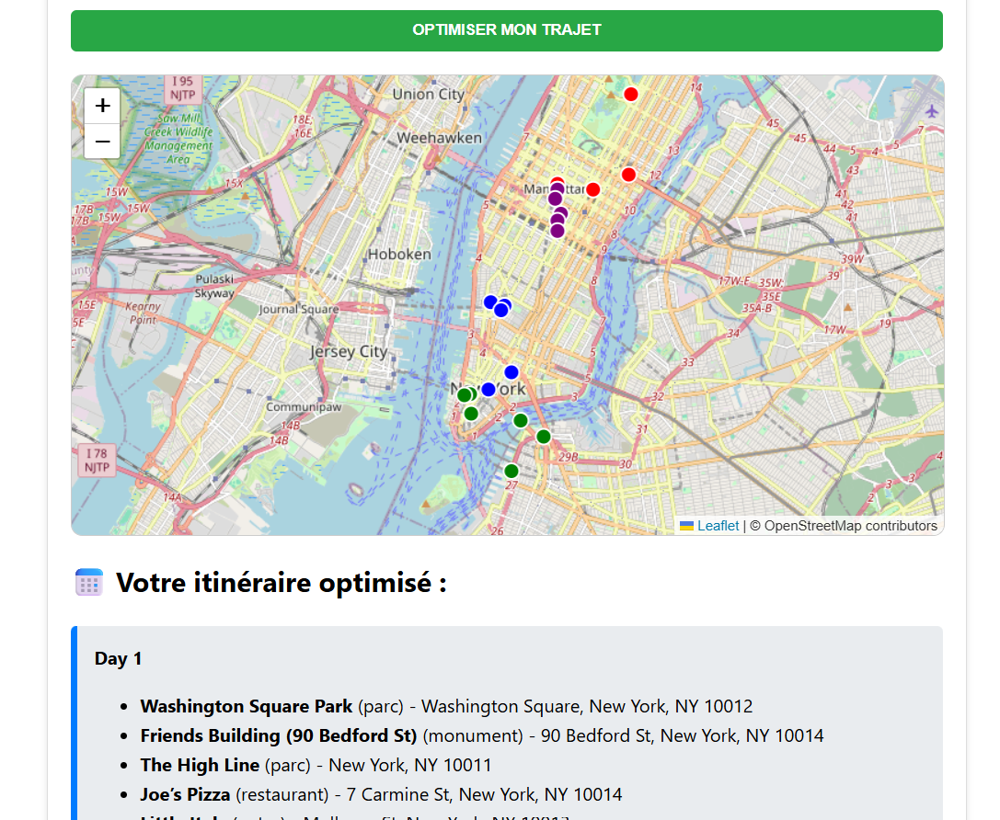

# 🗽 Smart Travel Planner - NYC

Un planificateur d'itinéraire intelligent qui utilise l'algorithme **K-Means** pour regrouper les activités par zone géographique et optimiser les déplacements quotidiens à New York.

## Application en production
👉 [Accéder à l'application](https://smart-travel-planner-pcox.onrender.com/)



⚠️ L'instance gratuite Render peut mettre ~50 secondes à démarrer après une période d'inactivité.


## Stack Technique
- **Backend :** Python (FastAPI), Scikit-Learn (K-Means), Pandas, Geopy, PostgreSQL.
- **Frontend :** HTML5, JavaScript (ES6), CSS3, Leaflet.js.
- **DevOps :** Docker, Docker Compose, GitHub Actions (CI/CD), Render.

## 📈 Évolution du Projet

### 🟢 Version 1.0 : Proof of Concept (PoC)
*La base fonctionnelle de l'optimiseur.*
- **Backend** : Implémentation de `scikit-learn` avec l'algorithme **K-Means standard**.
- **Frontend** : Formulaire dynamique permettant d'ajouter des lignes d'activités une par une.
- **DevOps** : Dockerisation initiale et pipeline CI (Linting).
- *Limite* : Itinéraires parfois déséquilibrés (un jour trop chargé par rapport aux autres).

### 🔵 Version 2.0 : Optimisation & UX (Actuelle)
*Amélioration de l'intelligence métier et de l'expérience utilisateur.*
- **Algorithme "Balanced Clustering"** : Passage à `k-means-constrained` pour garantir une répartition équitable des activités par jour (Solution au problème de surcharge).
- **Mode Bulk Input (Saisie rapide)** : Ajout d'un parser intelligent permettant de copier-coller une liste entière au format `Nom : Adresse (Catégorie)`.
- **Qualité logicielle** : 
    - Introduction des **tests unitaires poussés** (Pytest) couvrant les cas limites.
    - Rapport de couverture de code (Code Coverage).
- **UI/UX** : Refonte graphique avec CSS3 et mode de saisie hybride (Liste vs Texte).

### 🟣 Version 3.0 : Expérience utilisateur enrichie
*Focus sur les fonctionnalités et l'accessibilité.*

- **Historique des itinéraires** : Accès aux 5 derniers itinéraires générés depuis l'interface.
- **Carte interactive** : Visualisation sur OpenStreetMap avec points colorés par jour.
- ** Base de données persistante** : Historique stocké et accessible instantanément.
- **Architecture testée** : Dependency injection et tests couvrant tous les cas limites.

### 🚀 Version 4.0 : Déploiement Cloud (Actuelle)
*Mise en production sur infrastructure cloud.*

- **Déploiement backend** : API FastAPI déployée sur Render avec conteneurisation Docker.
- **Base de données cloud** : Migration vers PostgreSQL managé sur Render.
- **Déploiement frontend** : Interface déployée en Static Site sur Render.
- **CI/CD complet** : Redéploiement automatique à chaque push sur la branche main.

*Amélioration à venir : Optimisation du temps de démarrage (cold start) sur instance gratuite.*

## Pipeline CI/CD
Ce projet intègre une chaîne d'intégration continue automatisée via **GitHub Actions** qui effectue :
1. **Linting Python (Flake8)** : Vérification de la conformité du code backend.
2. **Linting JS (ESLint)** : Validation des standards du code frontend.
3. **Tests Unitaires (Pytest)** : Validation de la logique de calcul de l'API.
4. **Build Docker** : Vérification de la construction des images pour garantir la portabilité.

## Installation et Lancement
Assurez-vous d'avoir **Docker** et **Docker Compose** installés.

```bash
# Cloner le projet
git clone https://github.com/Lauriane4/smart-travel-planner.git

# Lancer l'application
docker-compose up --build

```

L'application est ensuite accessible sur http://localhost:3000 .

## Objectifs DevOps accomplis
- Conteneurisation multi-services.

- Automatisation de la qualité du code (Linting).

- Pipeline d'intégration continue (CI).

- Séparation des responsabilités (SOC) entre Front et Back.

- Déploiement continu (CD) sur Render.

- Base de données cloud PostgreSQL.

